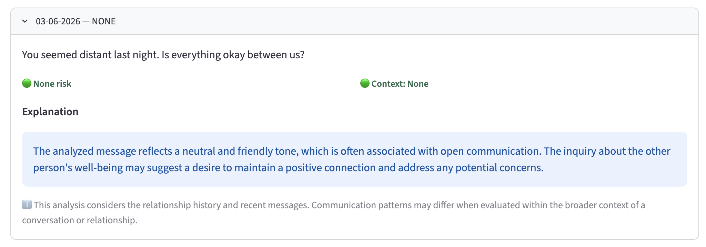
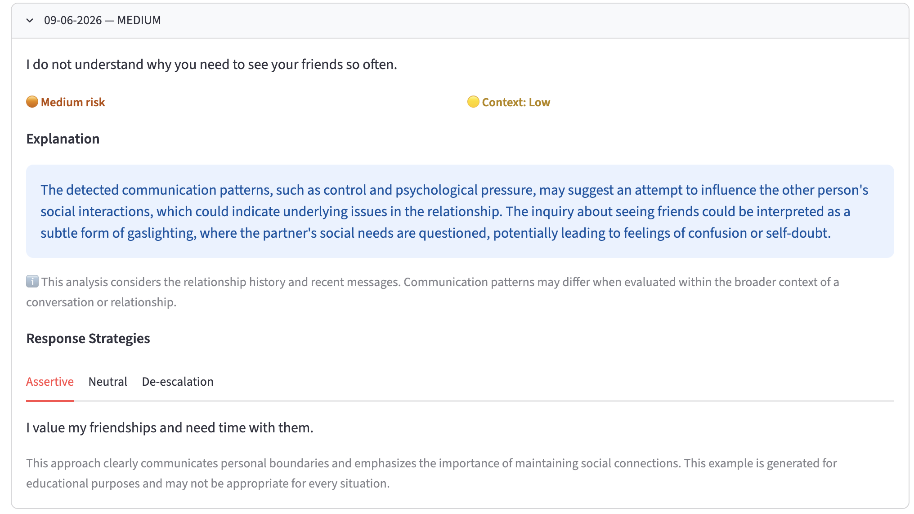
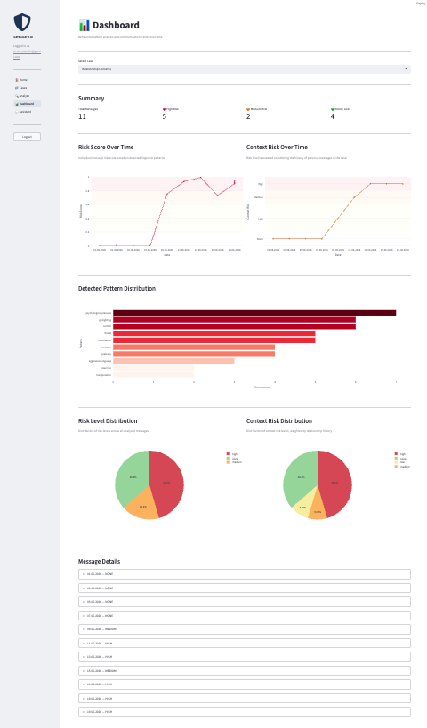
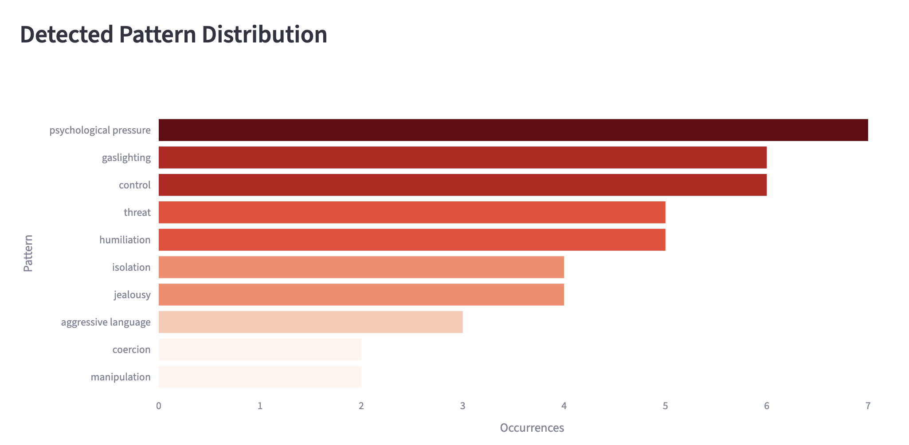
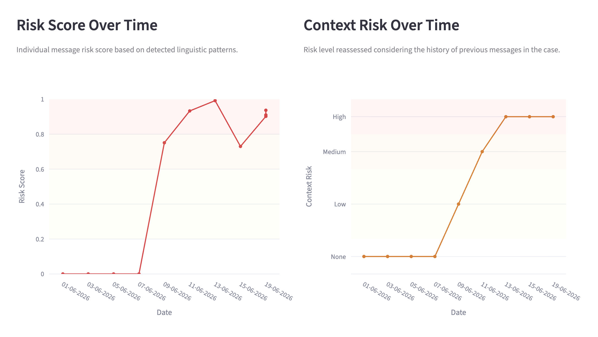
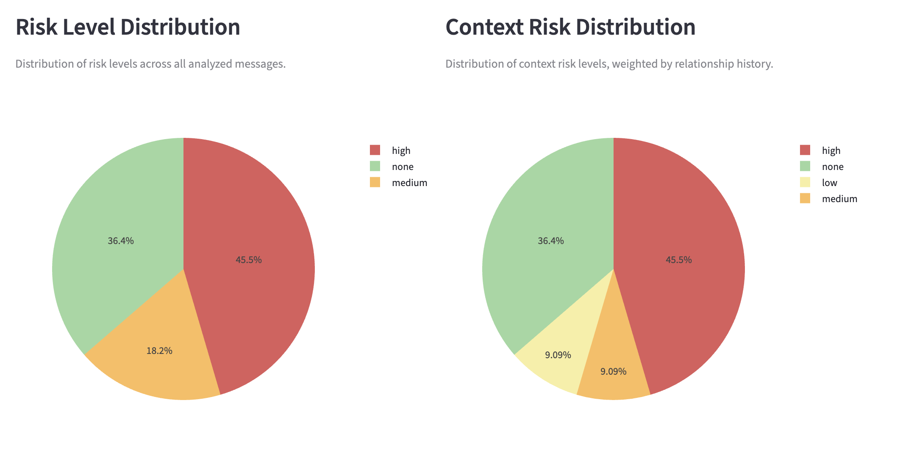
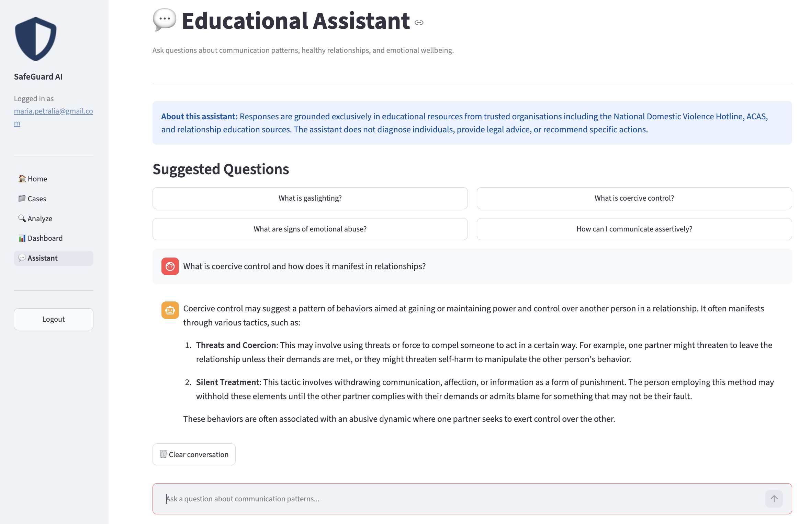

# 🛡️ SafeGuard AI

   

**AI-Powered Detection and Analysis of Toxic Communication Patterns**

SafeGuard AI helps users identify and understand potentially harmful communication patterns in personal, educational, and workplace contexts. The system analyzes messages and provides educational insights grounded in authoritative resources, not in isolation, but across time, tracking behavioral patterns and relational cycles.

> ⚠️ SafeGuard AI analyzes linguistic patterns only. It does not diagnose individuals, assign guilt, or provide legal or psychological advice. For privacy, avoid using real names in messages.

---

## Table of Contents

- [Overview](#overview)
- [Architecture](#architecture)
- [Tech Stack](#tech-stack)
- [Project Structure](#project-structure)
- [Setup](#setup)
- [Running the Application](#running-the-application)
- [API Endpoints](#api-endpoints)
- [AI Pipeline](#ai-pipeline)
- [Contextual Analysis](#contextual-analysis)
- [Dashboard](#dashboard)
- [Knowledge Base](#knowledge-base)
- [Ethical Principles](#ethical-principles)
- [Known Limitations](#known-limitations)
- [Future Improvements](#future-improvements)

---

## Overview

SafeGuard AI introduces **Behavioral Pattern Timeline** analysis. Instead of evaluating messages in isolation, the system tracks communication patterns over time, detecting escalation, recurring cycles, and emerging risks across a series of messages grouped in **Cases**.

Each case represents a 1-to-1 relationship — a personal conversation, a workplace exchange, or any interpersonal communication between two people. The system builds a cumulative **relationship summary** that evolves with every new message analyzed, enabling detection of patterns that only become visible across time, such as cycles of tension, manipulation, and reconciliation.

**Key features:**

- Multi-label toxic communication classification across 10 categories
- Contextual risk assessment based on relationship history
- Cumulative relationship summary updated after each analysis
- PII anonymisation before any external AI call (GDPR-aware)
- Retrieval-Augmented Generation (RAG) grounded in educational sources
- Behavioral timeline and pattern analytics dashboard
- Educational chat assistant with daily rate limiting
- JWT-authenticated multi-user REST API

---

## Architecture

```
User Input (Message)
        ↓
PII Anonymisation — Microsoft Presidio
        ↓
Relationship Context Retrieval
→ Last 3 analyzed messages from the case
→ Cumulative relationship summary
        ↓
Fine-tuned DistilBERT Gate — toxic / non-toxic
→ Threshold lowered if toxic history is present (context-aware gate)
        ↓ (if toxic or uncertain)
Zero-shot Classifier — facebook/bart-large-mnli
→ 10 toxic communication categories + confidence scores
→ Risk score: (avg_all + max_score) / 2
→ Risk level: none / low / medium / high
        ↓
RAG Retrieval — pgvector similarity search
→ Top 3 relevant educational chunks from knowledge base
        ↓
OpenAI GPT-4o-mini — RAG-grounded generation
→ Educational explanation (hedged language, context-aware)
→ 3 response strategies: Assertive / Neutral / De-escalation
→ Context risk level: none / low / medium / high
→ Updated relationship summary
        ↓
PostgreSQL Storage
→ Analysis saved with categories, risk score, explanation,
   strategies, context risk level
→ Case relationship summary updated
        ↓
Streamlit Dashboard
→ Risk score over time
→ Context risk over time
→ Pattern distribution
→ Risk level and context risk distribution
→ Message details timeline
```

---

## Tech Stack

| Layer | Technology |
|-------|-----------|
| Backend | FastAPI |
| Database | PostgreSQL 17 + pgvector |
| Authentication | JWT (python-jose + bcrypt) |
| AI Gate | Fine-tuned DistilBERT (civil_comments + custom examples) |
| AI Classifier | HuggingFace — facebook/bart-large-mnli (zero-shot) |
| AI Generator | OpenAI GPT-4o-mini |
| RAG | LangChain + pgvector + OpenAI text-embedding-3-small |
| PII Protection | Microsoft Presidio |
| Frontend | Streamlit + Plotly |

---

## Project Structure

```
safeguard-ai/
├── docs/
│   ├── screenshots/                    # UI screenshots
│   └── SafeGuard_AI_Presentation.pdf 
├── backend/
│   ├── app/
│   │   ├── api/
│   │   │   ├── routes/
│   │   │   │   ├── auth.py             # Register, login
│   │   │   │   ├── cases.py            # CRUD cases
│   │   │   │   ├── messages.py         # CRUD messages
│   │   │   │   ├── analysis.py         # AI analysis pipeline
│   │   │   │   └── assistant.py        # RAG educational assistant
│   │   │   └── dependencies.py         # JWT auth dependency
│   │   ├── core/
│   │   │   ├── config.py               # Environment settings
│   │   │   ├── security.py             # Password hashing, JWT
│   │   │   └── dependencies.py         # get_current_user
│   │   ├── db/
│   │   │   └── database.py             # SQLAlchemy engine, session
│   │   ├── models/
│   │   │   ├── user.py
│   │   │   ├── case.py
│   │   │   ├── message.py
│   │   │   ├── analysis.py
│   │   │   └── usage_log.py
│   │   ├── schemas/
│   │   │   ├── user.py
│   │   │   ├── case.py
│   │   │   ├── message.py
│   │   │   └── analysis.py
│   │   └── services/
│   │       ├── anonymizer.py           # Microsoft Presidio PII
│   │       ├── classifier.py           # DistilBERT gate + bart-large-mnli
│   │       ├── explainer.py            # OpenAI GPT-4o-mini
│   │       ├── rag_indexer.py          # Index knowledge base into pgvector
│   │       ├── rag_retriever.py        # Similarity search
│   │       └── finetune.py             # DistilBERT fine-tuning script
│   ├── main.py                         # FastAPI entry point
│   └── requirements.txt
├── frontend/
│   ├── app.py                          # Streamlit entry point + auth
│   ├── components.py                   # Shared sidebar, auth check
│   ├── pages/
│   │   ├── 1_Cases.py
│   │   ├── 2_Analyze.py
│   │   ├── 3_Dashboard.py
│   │   └── 4_RAG_Assistant.py
│   └── .streamlit/
│       └── config.toml
├── data/
│   └── knowledge_base/                 # Educational .txt documents for RAG
│       ├── healthy_relationships.txt
│       ├── coercive_control.txt
│       ├── gaslighting.txt
│       ├── emotional_abuse.txt
│       ├── manipulation_tactics.txt
│       ├── healthy_boundaries.txt
│       ├── bullying_workplace.txt
│       ├── workplace_mobbing.txt
│       ├── stalking.txt
│       ├── cyberbullying.txt
│       ├── assertive_communication.txt
│       ├── neutral_communication.txt
│       └── neutral_communication_examples.txt
├── models/
│   └── toxic_gate/                     # Fine-tuned DistilBERT (not in Git)
├── .env.example
├── .gitignore
└── README.md
```

---

## Setup

### Prerequisites

- Python 3.11+
- PostgreSQL 17 with pgvector extension
- OpenAI API key

### 1. Clone the repository

```bash
git clone https://github.com/MapiAI/SafeGuard-AI.git
cd safeguard-ai
```

### 2. Backend setup

```bash
cd backend
python -m venv venv
source venv/bin/activate        # Windows: venv\Scripts\activate

pip install -r requirements.txt
python -m spacy download en_core_web_lg
```

### 3. Environment variables

```bash
cp .env.example .env
```

Edit `.env` with your credentials:

| Variable | Description |
|----------|-------------|
| `DATABASE_URL` | PostgreSQL connection string |
| `SECRET_KEY` | JWT secret key (minimum 32 characters) |
| `ALGORITHM` | JWT algorithm (default: HS256) |
| `ACCESS_TOKEN_EXPIRE_MINUTES` | Token expiry in minutes (default: 30) |
| `OPENAI_API_KEY` | OpenAI API key for GPT-4o-mini and embeddings |
| `HUGGINGFACE_API_KEY` | Optional — HuggingFace API key |

### 4. Database setup

```bash
psql -U your_username postgres
CREATE DATABASE safeguard_ai;
\c safeguard_ai
CREATE EXTENSION vector;
\q
```

### 5. Index the knowledge base

```bash
python -m app.services.rag_indexer
```

This chunks the educational documents and stores embeddings in pgvector.

### 6. Fine-tune the gate model (optional)

```bash
python -m app.services.finetune
```

Trains DistilBERT on civil_comments dataset + custom toxic communication examples. Takes approximately 5-10 minutes on a modern laptop.

---

## Running the Application

### Backend

```bash
cd backend
source venv/bin/activate
uvicorn main:app --reload
```

- API: `http://localhost:8000`
- Swagger docs: `http://localhost:8000/docs`
- Health check: `http://localhost:8000/health`

### Frontend

```bash
cd frontend
streamlit run app.py
```

- Frontend: `http://localhost:8501`

---

## API Endpoints

### Authentication

| Method | Endpoint | Description |
|--------|----------|-------------|
| POST | `/auth/register` | Register a new user |
| POST | `/auth/login` | Login and receive JWT token |

### Cases

| Method | Endpoint | Description |
|--------|----------|-------------|
| GET | `/cases/` | List all cases for current user |
| POST | `/cases/` | Create a new case |
| GET | `/cases/{id}` | Get a specific case |
| PATCH | `/cases/{id}` | Update a case |
| DELETE | `/cases/{id}` | Delete a case |

### Messages

| Method | Endpoint | Description |
|--------|----------|-------------|
| GET | `/cases/{id}/messages/` | List all messages in a case |
| POST | `/cases/{id}/messages/` | Add a message to a case |
| GET | `/cases/{id}/messages/{msg_id}` | Get a specific message |
| PATCH | `/cases/{id}/messages/{msg_id}` | Update a message |
| DELETE | `/cases/{id}/messages/{msg_id}` | Delete a message (only if not yet analyzed) |

### Analysis

| Method | Endpoint | Description |
|--------|----------|-------------|
| POST | `/cases/{id}/messages/{msg_id}/analyze` | Run full AI analysis on a message |
| GET | `/cases/{id}/messages/{msg_id}/analysis` | Retrieve stored analysis |

### Assistant

| Method | Endpoint | Description |
|--------|----------|-------------|
| POST | `/assistant/ask` | Ask an educational question (10/day limit) |
| GET | `/assistant/usage` | Check daily question usage |

### System

| Method | Endpoint | Description |
|--------|----------|-------------|
| GET | `/` | API status |
| GET | `/health` | Health check |
| GET | `/me` | Current user info |

Full interactive documentation available at `/docs` (Swagger UI).

---

## AI Pipeline

### Stage 0 — PII Anonymisation

Microsoft Presidio detects and replaces personally identifiable information before any text reaches external AI models:

| Original | Anonymised |
|----------|-----------|
| John called me | `[PERSON]` called me |
| +39 02 1234567 | `[PHONE_NUMBER]` |
| maria@email.com | `[EMAIL_ADDRESS]` |

### Stage 1 — Relationship Context Retrieval

Before classification, the system retrieves:
- The **last 3 analyzed messages** from the case with their risk levels and detected categories
- The **cumulative relationship summary** — a GPT-generated behavioral profile of the relationship updated after every analysis

If toxic patterns are found in the recent history, the DistilBERT gate threshold is lowered from `0.92` to `0.75`, making the classifier more sensitive to ambiguous messages that might be harmful in context.

### Stage 2 — Toxic Gate (DistilBERT)

Fine-tuned DistilBERT classifies each message as `toxic` or `non-toxic`:

- `non-toxic` with confidence ≥ threshold → pipeline stops, `risk_level: none`
- Otherwise → proceeds to zero-shot classification

Training data: civil_comments (3,000 balanced samples) + custom relational examples (416 samples covering gaslighting, isolation, jealousy, manipulation, coercive control, and neutral conversation).

### Stage 3 — Multi-label Classification (bart-large-mnli)

Zero-shot classification across 10 toxic communication categories:

| Category | Description |
|----------|-------------|
| Control | Limiting personal freedom and autonomy |
| Manipulation | Exploiting feelings to influence behavior |
| Threat | Direct threats and intimidation |
| Psychological Pressure | Emotional coercion |
| Jealousy | Possessive behavior |
| Isolation | Separating from friends and family |
| Gaslighting | Reality distortion |
| Humiliation | Degradation and put-downs |
| Aggressive Language | Verbal aggression and insults |
| Coercion | Forced compliance |

Risk score formula: `(average across all 10 categories + max category score) / 2`
This balances overall toxicity distribution with the strength of the dominant pattern.

### Stage 4 — RAG Retrieval

pgvector similarity search retrieves the top 3 most relevant educational chunks from the knowledge base, based on the message content and detected categories.

### Stage 5 — Grounded Generation (GPT-4o-mini)

OpenAI GPT-4o-mini generates — considering both the current message and the relationship history:

- **Explanation** — educational description of detected patterns using hedged language, grounded exclusively in retrieved documents and informed by relationship context
- **Response strategies** — three general communication approaches (Assertive, Neutral, De-escalation) with educational disclaimer
- **Context risk level** — risk assessment considering the full relationship history, not just the current message
- **Updated relationship summary** — cumulative behavioral profile updated with new patterns observed

---

## Contextual Analysis

One of SafeGuard AI's core design principles is that **a single message rarely tells the full story**.

The system tracks each case as a behavioral timeline. After each analysis, GPT-4o-mini updates a **relationship summary** — a short narrative of the communication patterns observed so far. This summary is passed to every subsequent analysis, enabling the system to:

- Detect **escalation cycles** — tension building over multiple messages
- Recognize **reconciliation patterns** — apparent calm following toxic episodes
- Identify **context-dependent risk** — messages that appear neutral in isolation but are concerning within a pattern of control or manipulation

The `context_risk_level` field reflects this contextual assessment. It may differ from the message-level `risk_level`:

| Message | Risk Level | Context Risk Level |
|---------|-----------|-------------------|
| "Good morning!" | none | none |
| "Who were you with tonight?" | none | none → medium (with history) |
| "You are nothing without me." | medium | high (pattern established) |

---

## Dashboard

The analytics dashboard provides a visual overview of communication patterns across a case:

- **Summary** — total messages analyzed, count by risk level (High / Medium / None-Low)
- **Risk Score Over Time** — line chart showing how the raw classification risk score evolves across messages
- **Context Risk Over Time** — line chart of the contextual risk level, reflecting the relationship history assessed by GPT
- **Detected Pattern Distribution** — horizontal bar chart showing frequency and confidence of each of the 10 toxic communication categories
- **Risk Level Distribution** — pie chart of message-level risk classification
- **Context Risk Distribution** — pie chart of context-aware risk assessment
- **Message Details** — expandable timeline of all analyzed messages with date, risk level, and full analysis

---

## Knowledge Base

The RAG knowledge base contains 90+ chunks from 13 educational documents sourced from:

| Source | Topics |
|--------|--------|
| thehotline.org | Coercive control, gaslighting, emotional abuse |
| loveisrespect.org | Healthy relationships, relationship spectrum |
| verywellmind.com | Manipulation tactics, healthy boundaries, stalking |
| acas.org.uk | Workplace bullying |
| allvoices.co | Workplace mobbing |
| stopbullying.gov | Bullying, cyberbullying |
| skillsyouneed.com | Assertive communication |

---

## Ethical Principles

SafeGuard AI is designed with Responsible AI principles:

- **Pattern analysis only** — the system analyzes linguistic patterns, never people
- **Hedged language** — responses always use "may suggest", "is often associated with", "could indicate"
- **RAG-grounded** — explanations are based exclusively on retrieved educational documents
- **PII protection** — personal information is anonymised before any external AI call
- **No diagnosis** — the system never labels individuals or provides clinical assessments
- **No legal advice** — the system never recommends reporting someone or taking legal action
- **Transparent limitations** — the system acknowledges uncertainty and encourages professional support

The ethical policy is embedded directly in the GPT system prompt and enforced at the architecture level through RAG-grounding.

---

## Known Limitations

- Social media language, sarcasm, emoji-based communication, and non-English input are not fully supported
- The DistilBERT gate was trained primarily on civil_comments (online content). Subtle relational manipulation may still occasionally be misclassified as non-toxic
- The zero-shot classifier (bart-large-mnli) may produce false positives on decontextualized or ambiguous phrases
- Contextual analysis improves with more messages. Early messages in a case have limited history to draw from
- SafeGuard AI is designed for 1-to-1 communication analysis. Group conversations with multiple authors are not supported in the current version

---

## Future Improvements

- Fine-tuned multi-label classifier on domain-specific relational communication data (gold dataset)
- RoBERTa-base as replacement for bart-large-mnli with category-specific hypothesis templates
- Support for additional languages (Italian, German, Spanish)
- Screenshot OCR ingestion for image-based messages
- WhatsApp and email export parsing
- Mobile application
- Export reports for professional counselors
- Human-in-the-loop review interface for uncertain classifications
- Author-level analysis for multi-participant conversations
- Deployment on Render + Supabase

---

## Screenshots

### Message Analysis



### Dashboard





### RAG Educational Assistant


--- 

## Presentation
[📊 View Presentation (PDF)](docs/SafeGuard_AI_Presentation.pdf)

---

## License

MIT License — see [LICENSE](LICENSE) for details.

---

*SafeGuard AI — Built with care for responsible AI design.*

**👤 Author**

Maria Petralia (MaPi)

- GitHub: [MapiAI](https://github.com/MapiAI)
- LinkedIn: [mariapetralia](https://linkedin.com/in/mariapetralia)
